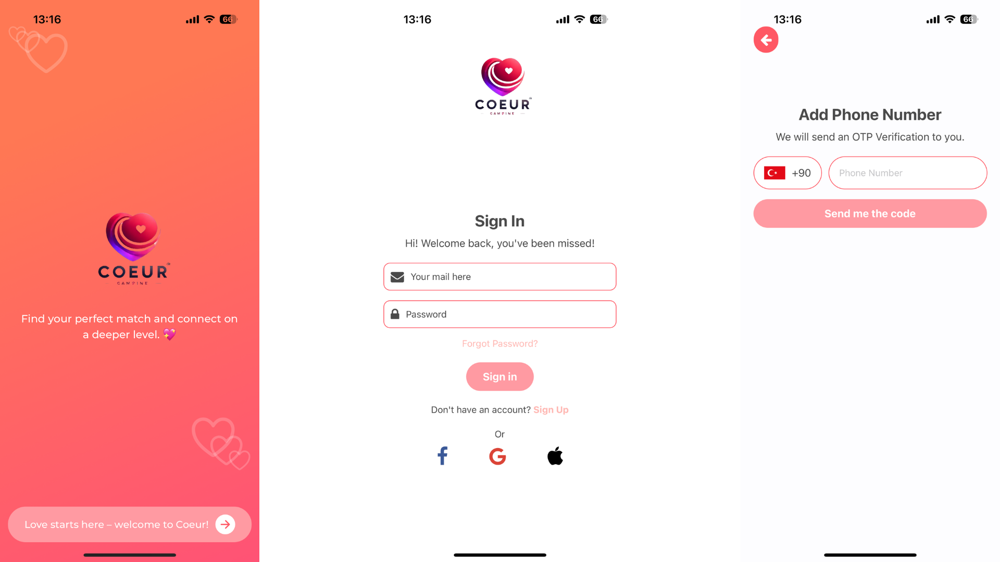
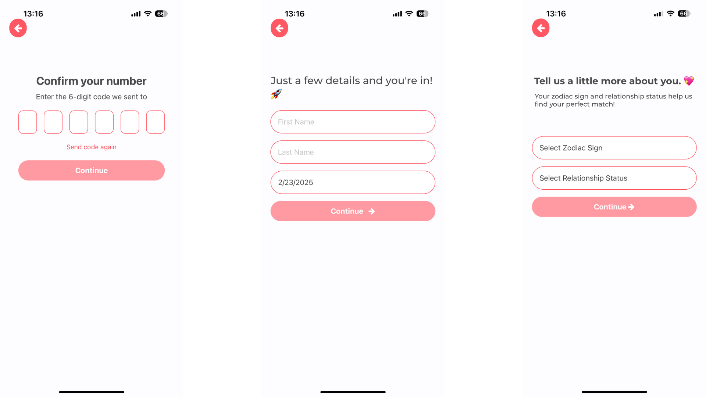
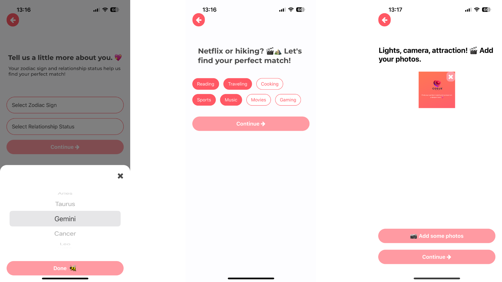
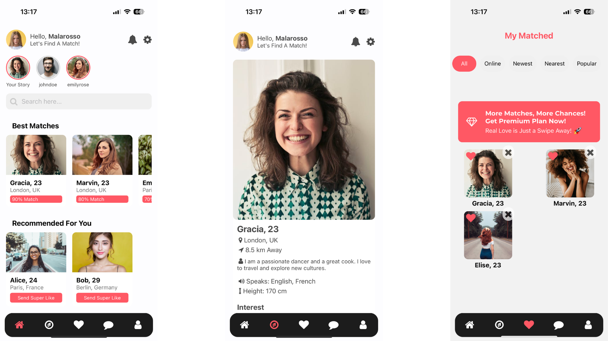
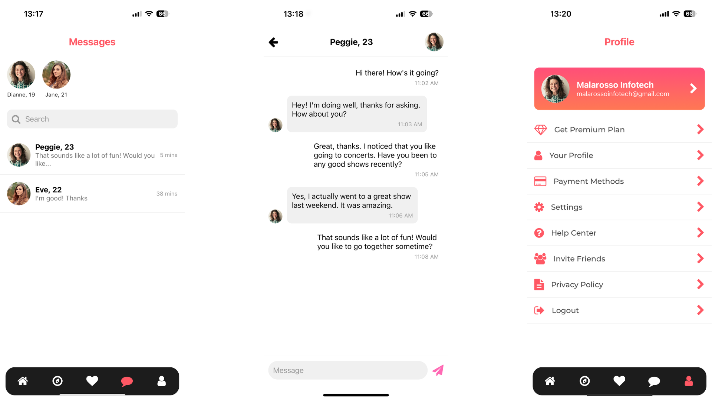

# Chat Uygulaması

Bu proje, bir sohbet uygulaması kullanıcı arayüzü (UI) örneğidir. Uygulama, mesajlaşma ekranı ve mesaj giriş alanı gibi temel bileşenleri içerir. Bu proje, herhangi bir API bağlantısı içermemektedir ve sadece ön uç geliştirme amacıyla tasarlanmıştır.

## Özellikler

- Mesajlaşma ekranı
- Mesaj giriş alanı
- Eşleşme ekranı
- Profil ekranı
- Ayarlar ekranı
- Eşleşmeler ekranı
- Hakkında ekranı


## Gereksinimler

- Node.js
- React Native

## Kurulum

1. Projeyi klonlayın:
   ```bash
   git clone https://github.com/kullaniciadi/chat-uygulamasi.git
   cd chat-uygulamasi
   ```

2. Gerekli paketleri yükleyin:
   ```bash
   npm install
   ```

3. Uygulamayı çalıştırın:
   ```bash
   npm start
   ```

---

# Chat Application

This project is a sample user interface (UI) for a chat application. It includes basic components such as a messaging screen and a message input area. This project does not include any API connections and is designed solely for front-end development purposes.

## Features

- Messaging screen
- Message input area
- Match screen
- Profile screen
- Settings screen
- About screen
- Automatically keeps the message input area visible when the keyboard is opened

## Requirements

- Node.js
- React Native

## Installation

1. Clone the project:
   ```bash
   git clone https://github.com/username/chat-application.git
   cd chat-application
   ```

2. Install the required packages:
   ```bash
   npm install
   ```

3. Run the application:
   ```bash
   npm start
   ```

## Screenshots

- **Screenshot 1**
  

- **Screenshot 2**
  

- **Screenshot 3**
  

- **Screenshot 4**
  

- **Screenshot 5**
  